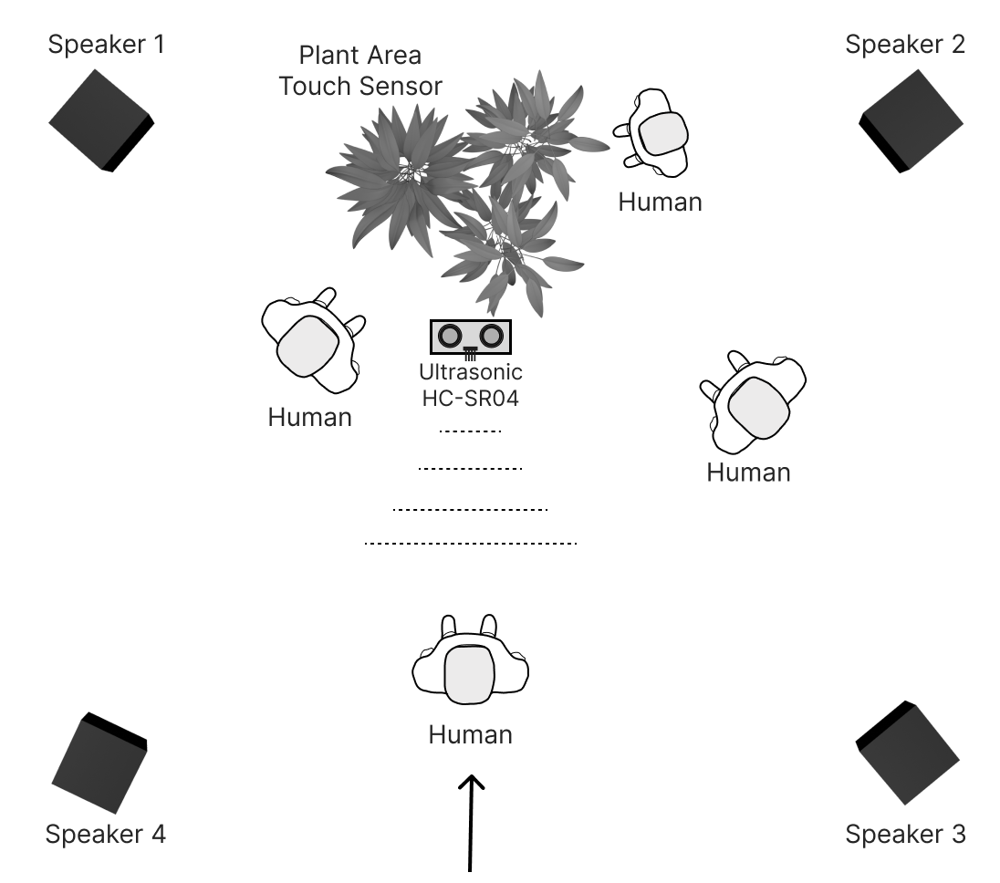

# Interactive Sound Installation: <br>Nature, City, and Human Presence

> **Undergraduate Thesis Project** | Department of Audio & Visual Arts, Ionian University (2023)  
> **Author & Creator:** Chrysanthi Matsagka ([cmatsagka@gmail.com](mailto:cmatsagka@gmail.com))
>
> 🌐 **Live Project Website:** [View Documentation Website](https://your-github-username.github.io/your-repository-name/) _(Note: The website is written in Greek)_

## Overview

An interactive sound installation that invites visitors to interact with living plants situated in a designated space. A real-time generative sound system creates shifting soundscapes that respond directly to the visitor's proximity and physical contact with the plants.

The core artistic and philosophical goal is to investigate human-nature relationships, exploring whether humans act in harmony with their ecosystem or dominate it to the point of collapse.

<p align="center">
  
</p>

**Concept & Execution:**  
Every single aspect of this project—including the overarching concept, sound design, graphics, 3D modeling, physical computing, and programming—was conceived, designed, and developed entirely by the author as an individual undergraduate thesis.

---

## System Architecture & Tech Stack

The installation bridges the physical world with real-time digital audio processing:

- **Physical Computing & Processing:** Raspberry Pi and Arduino microcontrollers connected to custom sensors.
- **Sensors:**
    - _Ultrasonic/Distance Sensor:_ Detects the visitor entering the space and initiates the human-element soundscape.
    - _Touch/Capacitive Sensor:_ Attached to the plant to register physical contact and interaction levels.
- **Audio Engine:** **Pure Data (Pd)** running on the hardware setup for real-time generative sound synthesis and sample playback.
- **Communication:** Serial communication pipeline passing sensor data from the sensors to the processing unit.
- **Web Presentation:** HTML5, CSS3, and vanilla JavaScript (accompanying project documentation website).

---

## Soundscape States

The audio system is governed by a graphical score methodology and operates across three distinct states:

1.  **State 1 (Pure Nature):** Ambient, low-frequency organic soundscapes representing a self-sustaining natural environment.
2.  **State 2 (Coexistence):** Triggered when a visitor enters the space. Urban sound layers blend with nature as long as plant interactions remain within balanced, harmonious limits.
3.  **State 3 (Defense/Rebellion):** Triggered if interaction limits are overstepped (excessive touch or human over-dominance). The soundscape transforms into a turbulent, hostile environment, eventually leading to a simulated "reset" where the human element is stripped away.

---

## Repository Structure

```text
├── index.html               # Thesis project documentation website
├── style.css                # Styling for the project web page
├── mobile-nav.js            # Mobile navigation script
├── arduino/                 # Arduino sketches for sensor data acquisition
├── pure-data/               # Pure Data (.pd) patches for sound generation
├── images/                  # Project visuals & documentation assets
└── video/                   # Video documentation
```

## Note on Documentation:

The companion website contains much deeper, comprehensive information regarding the theoretical framework, technical implementation, and aesthetic choices behind the project. Please note that the website text is written in Greek.

---

## 🌐 Showcase & Links

### Live Site: https://cmatsagka.github.io/installation-repo/

### Video Demonstrations:

Check the video/ directory in this repository to watch the physical installation running live with the Raspberry Pi and sensor setup.

---

## 📄 Licensing & Copyright

- **Source Code** (Arduino scripts, Pure Data patches, and JavaScript): Licensed under the **MIT License**. You can view the `LICENSE` file for details.
- **Artistic Content, Media, 3D Models, and Documentation Text**: Licensed under the **Creative Commons Attribution-NonCommercial 4.0 International (CC BY-NC 4.0)** license.

© 2023–2026 Chrysanthi Matsagka. All rights reserved for creative assets.

[](http://creativecommons.org/licenses/by-nc/4.0/)
